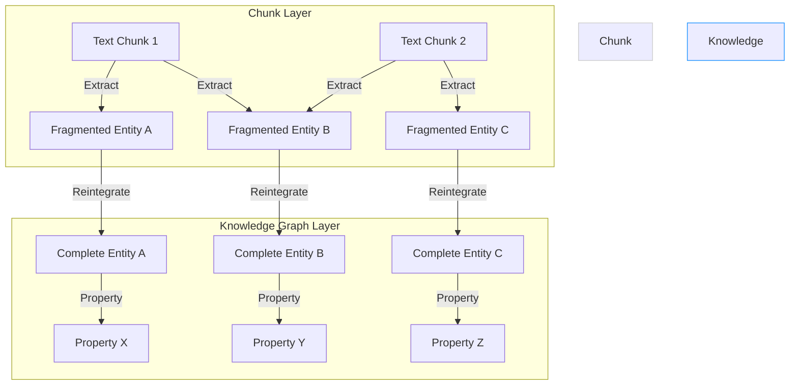

# LinkRAG/Graph-Chunking
⚠️ This project is under development

LinkRAG is a knowledge graph-based RAG (Retrieval Augmented Generation) system that improves text generation accuracy by leveraging structured knowledge from a knowledge graph.


## Concept: Graph-based denoise
Unlike typical "Entity-->relation-->Entity" graph structure, I adopt "Entity-->Property-->Entity" to better storing knowledge information and providing more comprehensive information. When the construction of the relationship-based knowledge graph is completed, the system will further summarize all entity-relationships and generate property nodes.

This dual-layer knowledge graph system reintegrates fragmented information points from text chunks, transforming them into independent and complete knowledge units. From this perspective, the entire system can be viewed as a novel form of 'conceptual chunking' - one that segments documents based on comprehensive understanding rather than simple sentence patterns (recurrent chunking) or semantic similarity (semantic chunking).





## Features

- **SurrealDB Integration** - Full-featured graph database for knowledge storage:
  - Nodes for entities and properties
  - Edges for relationships
  - Automatic schema-less document storage
  - Graph traversal queries
  - Built-in authentication and permissions
- Semantic chunking and embedding
- Multiple LLM workflow configurations

## Installation

```bash
# Using pnpm (recommended)
pnpm install

# Start SurrealDB (optional - if using local instance)
docker run --rm -p 8000:8000 surrealdb/surrealdb:latest start --log trace --user root --pass fl5ox03
```

## Configuration

Create a `.env` file based on `.env.example`:

```bash
cp .env.example .env
```

### Required environment variables:

#### SurrealDB Configuration
- `SURREALDB_URL` - Connection URL (default: `http://127.0.0.1:8000/rpc`)
- `SURREALDB_NAMESPACE` - Database namespace (default: `test`)
- `SURREALDB_DATABASE` - Database name (default: `test`)
- `SURREALDB_USER` - Database username (default: `root`)
- `SURREALDB_PASS` - Database password (default: `fl5ox03`)

#### LLM Configuration
- `OPENAI_API_KEY` - For LLM operations

