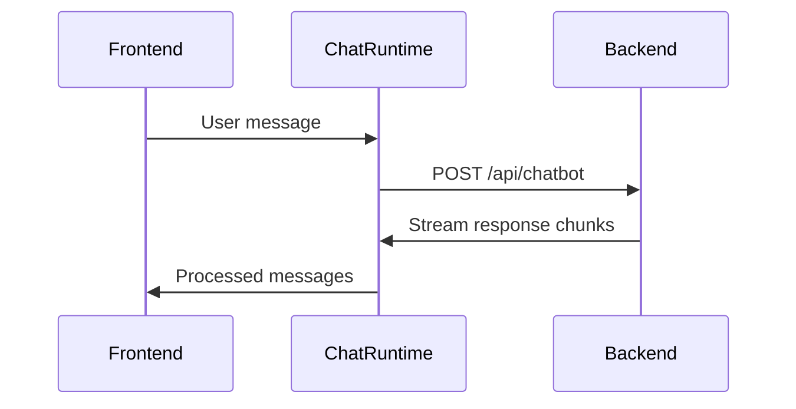
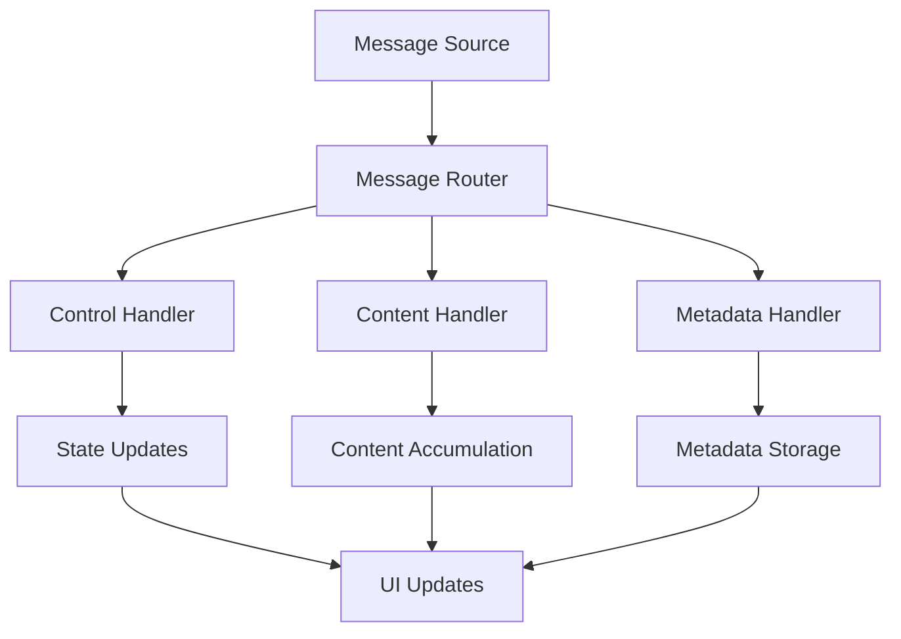

# Chat Message Pipeline Design

## Current Architecture Analysis

### Components
1. **Frontend**: `AssistantSidebar.tsx`
   - Handles UI rendering and user interactions
   - Uses `ChatRuntime` hook for chat logic

2. **Middleware**: `ChatRuntime.tsx`
   - Manages chat state and message processing
   - Connects frontend to backend API

3. **Backend**: `route.ts` + `agentService.ts`
   - Processes chat requests
   - Generates response streams

### Current Message Flow


## Proposed Message Pipeline Design

### Message Type Taxonomy

```typescript
interface BaseMessage {
  type: string;
  timestamp: Date;
  node?: string; // Processing node identifier
}

interface ControlMessage extends BaseMessage {
  type: 'init' | 'status' | 'error';
  status?: 'start' | 'end' | 'error';
  error?: string;
}

interface ContentMessage extends BaseMessage {
  type: 'content' | 'stream';
  content: string;
  isFinal?: boolean;
}

interface MetadataMessage extends BaseMessage {
  type: 'references' | 'quizzes' | 'sources';
  data: any[];
}
```

### Pipeline Architecture



### Implementation Plan

1. **Backend Modifications**
   - Update `transformAgentStream` in `agentService.ts` to use new message types
   - Ensure backward compatibility with existing clients

2. **Middleware Updates**
   - Create `messageRouter` in `ChatRuntime.tsx`
   - Implement handlers for each message type
   - Maintain current UI update logic

3. **Frontend Changes**
   - Update message display logic in `AssistantSidebar.tsx`
   - Add support for new message types

### Migration Strategy

1. Phase 1: Add new message types alongside existing ones
2. Phase 2: Gradually migrate components to use new types
3. Phase 3: Remove deprecated message types

## Benefits

1. **Clear Separation of Concerns**
   - Dedicated handlers for different message types
   - Easier to add new message types

2. **Improved Maintainability**
   - Type-safe message processing
   - Better error handling

3. **Extensibility**
   - Simple to add new message categories
   - Supports future features

## Next Steps

1. Review and approve this design
2. Implement backend changes
3. Update middleware
4. Modify frontend components
5. Test and validate