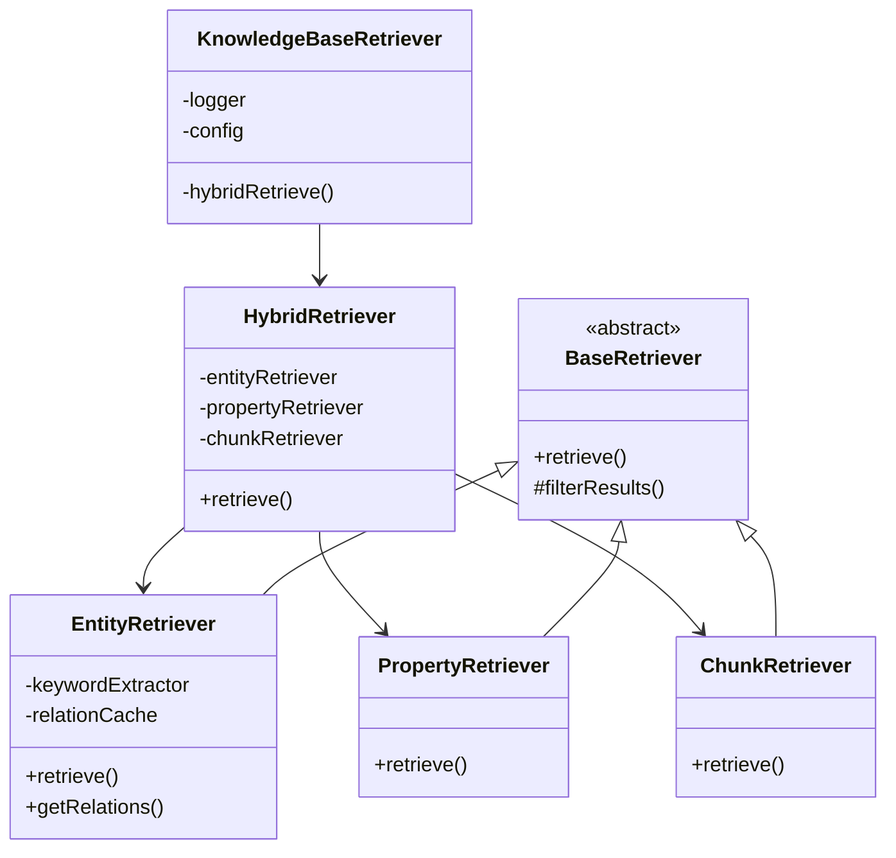

# KnowledgeBaseRetriever Refactoring Plan

This document outlines a refactoring plan for the `KnowledgeBaseRetriever` class to improve its structure, maintainability, and adherence to the Single Responsibility Principle.

## Current State Analysis

The existing `KnowledgeBaseRetriever` class currently handles multiple responsibilities, including:
- Chunk retrieval
- Property retrieval
- Entity retrieval (both keyword and semantic)
- Hybrid retrieval coordination
- Relation caching
- Query classification

This leads to a large class with complex methods, making it harder to understand, test, and maintain.

## Proposed Refactoring Structure

The refactoring proposes splitting the `KnowledgeBaseRetriever` into smaller, more focused classes, each responsible for a specific type of retrieval or coordination.

## Key Changes and Responsibilities

1.  **`KnowledgeBaseRetriever` (Orchestrator)**:
    *   This class will become the orchestrator, primarily responsible for initializing and coordinating the various specialized retrievers.
    *   It will expose the main `hybridRetrieve` method, delegating the actual retrieval logic to the new specialized classes.
    *   It will manage the overall configuration.

2.  **`BaseRetriever` (Abstract Base Class)**:
    *   An abstract class to define common interfaces and shared utility methods for all specific retriever implementations.
    *   Common functionalities like result filtering based on `semantic_search_threshold` and error handling for embedding generation can be moved here.

3.  **`EntityRetriever`**:
    *   **Responsibility**: Solely responsible for retrieving entities.
    *   **Methods**:
        *   `entity_retriever(query: string, top_k: number)`: Implements the logic for both keyword-based and semantic entity retrieval.
        *   `entity_keyword_retriever(entities: string[])`: Extracts keyword-based entity retrieval logic.
        *   `get_relations_of_entity(entityId: RecordId)`: Handles fetching relations for a given entity, including caching.
    *   **Dependencies**: `KeywordExtractor`, `surrealDBClient`, `embedding`.

4.  **`PropertyRetriever`**:
    *   **Responsibility**: Solely responsible for retrieving properties.
    *   **Methods**:
        *   `property_retriever(query: string, top_k: number)`: Implements the semantic property retrieval logic.
        *   `property_keyword_retriever(query: string)`: Implements the keyword-based property retrieval logic.
    *   **Dependencies**: `surrealDBClient`, `embedding`, `baml_client`.

5.  **`ChunkRetriever`**:
    *   **Responsibility**: Solely responsible for retrieving chunks/documents.
    *   **Methods**:
        *   `chunks_retriver(query: string, top_k: number)`: Implements the semantic chunk retrieval logic.
    *   **Dependencies**: `surrealDBClient`, `embedding`.

6.  **`HybridRetriever`**:
    *   **Responsibility**: Manages the hybrid retrieval process, combining results from `EntityRetriever`, `PropertyRetriever`, and `ChunkRetriever` based on configured weights.
    *   **Methods**:
        *   `hybridRetrieve(query: string, top_k: number, HyDE: boolean)`: Orchestrates the calls to individual retrievers and combines their results.
        *   `classifyQuery(query: string)`: Remains responsible for classifying the query type.
    *   **Dependencies**: Instances of `EntityRetriever`, `PropertyRetriever`, `ChunkRetriever`.

## Benefits of this Refactoring

*   **Single Responsibility Principle (SRP)**: Each class will have a clear, single responsibility, making the codebase easier to understand and manage.
*   **Improved Maintainability**: Changes to one retrieval method will not impact others, reducing the risk of introducing bugs.
*   **Enhanced Testability**: Individual retriever components can be tested in isolation, simplifying unit testing.
*   **Better Readability**: Smaller, more focused classes and methods are easier to read and comprehend.
*   **Increased Flexibility**: New retrieval methods or strategies can be added more easily without modifying existing core logic.
*   **Clearer Dependencies**: Dependencies between components become explicit and manageable.

## Next Steps

Once this plan is approved, the implementation will involve:
1.  Creating new files for `BaseRetriever`, `EntityRetriever`, `PropertyRetriever`, `ChunkRetriever`, and `HybridRetriever`.
2.  Migrating relevant methods and logic from `KnowledgeBaseRetriever.ts` to the new files.
3.  Updating `KnowledgeBaseRetriever.ts` to instantiate and use the new specialized retriever classes.
4.  Updating imports and references across the codebase as needed.
5.  Ensuring all existing functionalities are preserved and tested.